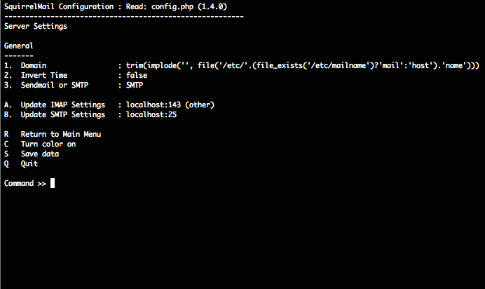

---
author:
  name: Alex Fornuto
  email: afornuto@linode.com
description: 'A guide to installing the SquirrelMail web client for email on Ubuntu or Debian 8.'
keywords: ["squirrelmail", " squirrel mail", " debian", " debian 8", " mail client", " ubuntu", " ubuntu 16"]
license: '[CC BY-ND 4.0](https://creativecommons.org/licenses/by-nd/4.0)'
modified: 2016-06-14
modified_by:
  name: Edward Angert
published: 2014-01-14
title: Install SquirrelMail on Ubuntu 16.04 or Debian 8
external_resources:
 - '[Official SquirrelMail Documentation](http://squirrelmail.org/documentation/)'
---

SquirrelMail is a webmail package, written in PHP, which supports both SMTP and IMAP protocols, and features cross-platform compatibility. SquirrelMail requires a web server with PHP to run properly. For this guide we'll be using Apache 2. If you don't already have Apache and PHP installed, you can check our [LAMP Server on Ubuntu 16.04](/docs/web-servers/lamp/install-lamp-stack-on-ubuntu-16-04/) or [LAMP Server on Debian 8](/docs/web-servers/lamp/lamp-on-debian-8-jessie/) guide.


This guide is written for a non-root user. Commands that require elevated privileges are prefixed with `sudo`. If you're not familiar with the `sudo` command, you can check our [Users and Privileges](/docs/tools-reference/linux-users-and-groups/) guide.


## Installation

Update the system and install SquirrelMail from the repositories.

1.  First, install the most recent system updates:

        sudo apt-get update
        sudo apt-get upgrade

2.  Install SquirrelMail:

        sudo apt-get install squirrelmail

## Configure the Virtual Host

To access SquirrelMails's web interface, create and configure a copy of its default virtual host configuration file in the Apache directory. Configure the settings in the copied file to match your Linode and domain settings.

1.  SquirrelMail provides a default configuration file for Apache in `/etc/squirrelmail/apache.conf`. Copy this configuration file into your `sites-available` folder with the command:

        sudo cp /etc/squirrelmail/apache.conf /etc/apache2/sites-available/squirrelmail.conf

2.  Edit the configuration file to uncomment the `<VirtualHost 1.2.3.4:80>` block by removing the pound symbol (`#`), as shown below. Edit the IP and ServerName to match your Linode and domain settings:

    
Alias /squirrelmail /usr/share/squirrelmail

<Directory /usr/share/squirrelmail>
  Options FollowSymLinks
  <IfModule mod_php5.c>
    php_flag register_globals off
  </IfModule>
  <IfModule mod_dir.c>
    DirectoryIndex index.php
  </IfModule>

  # access to configtest is limited by default to prevent information leak
  <Files configtest.php>
    order deny,allow
    deny from all
    allow from 127.0.0.1
  </Files>
</Directory>

# users will prefer a simple URL like http://webmail.example.com
<VirtualHost *:80>
  DocumentRoot /usr/share/squirrelmail
  ServerName squirrelmail.example.com
</VirtualHost>

# redirect to https when available (thanks omen@descolada.dartmouth.edu)
#
#  Note: There are multiple ways to do this, and which one is suitable for
#  your site's configuration depends. Consult the apache documentation if
#  you're unsure, as this example might not work everywhere.
#
#<IfModule mod_rewrite.c>
#  <IfModule mod_ssl.c>
#    <Location /squirrelmail>
#      RewriteEngine on
#      RewriteCond %{HTTPS} !^on$ [NC]
#      RewriteRule . https://%{HTTP_HOST}%{REQUEST_URI}  [L]
#    </Location>
#  </IfModule>
#</IfModule>



    
If Apache is serving other virtual hosts you may need to adjust them and/or this configuration file to prevent any conflicts. If you're running Apache solely for SquirrelMail, you may still want to remove the default virtual host from `sites-enabled`.


3.  Enable the new virtual host:

        sudo a2ensite squirrelmail.conf

4.  Reload Apache:

        sudo systemctl reload apache2.service

You should now be able to see SquirrelMail's default login page in your browser after navigating to your Linode's IP address or domain:

## Configure SquirrelMail

Before using SquirrelMail for the first time, configure it to access your mail server. SquirrelMail provides a tool called `squirrelmail-configure`, an interactive interface which edits the `/etc/squirrelmail/config.php` file for you with the input you provide.

1.  Launch the `squirrelmail-configure` application:

        sudo squirrelmail-configure

    This will bring up the menu shown below:

    

2.  There are many options to adjust here; too many for the scope of this guide. The only settings required to make SquirrelMail work are the `Server Settings`. Enter **2** to bring up the Server Settings submenu:

    

3.  If your mail server is on the same Linode as your SquirrelMail installation, you may not need to make any adjustments to the default settings. Otherwise, adjust the **Domain**, **IMAP**, and **SMTP** settings to match the mail server you want to connect to. You can find additional configuration tips for this section from [SquirrelMail's official documentation](http://squirrelmail.org/docs/admin/admin-5.html#ss5.3).

    
If your email server uses `STARTTLS` encryption, as our [Email with Postfix, Dovecot, and MySQL](/docs/email/postfix/email-with-postfix-dovecot-and-mysql/) guide does, You will not be able to authenticate using this version of Squirrelmail. Version 1.5.1 and higher can use `STARTTLS`, but are in development and not available in the main repositories. You can [download](https://squirrelmail.org/download.php) the latest build from Squirrelmail's website.


4.  When done, press `S` to save your changes, then press Q to quit.

## Sign In to the Web Interface

1.  At this point you should be able to log in to the SquirrelMail Login page using your email credentials. Navigate in your web browser to the Linode's IP address, or domain name depending on how you've configured the virtual host:

    

2.  The interface layout follows standard email convention; all common functions should be easily accessible:

    

3.  Once you're finished, you can sign out using the link in the upper-right corner. Always remember to sign out if you're using a public computer.
