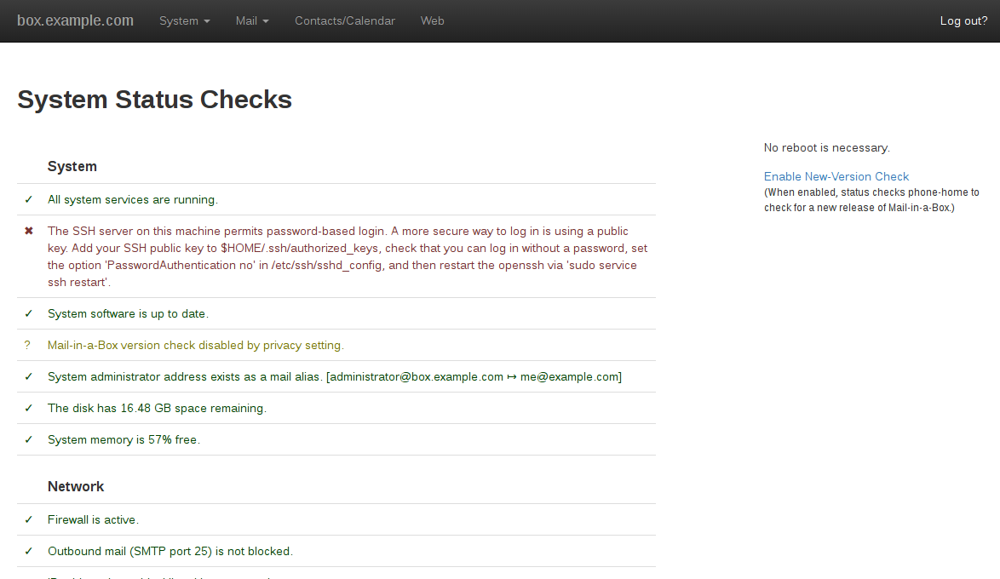

---
author:
  name: Linode Community
  email: docs@linode.com
description: 'This guide shows how to install and run Mail-in-a-Box, a simple, comprehensive, preconfigured email package.'
keywords: ["install mail-in-a-box", "webmail control panel", "caldav", "cardav", " TLS certificate"]
license: '[CC BY-ND 4.0](https://creativecommons.org/licenses/by-nd/4.0)'
published: 2017-08-29
modified: 2017-08-30
modified_by:
  name: Alexandru Andrei
title: How to Create an Email Server with Mail-in-a-Box
contributor:
  name: Alexandru Andrei
external_resources:
- '[Mail-in-a-Box Official Website](https://mailinabox.email/)'
---

If you chose to host your own email server, but after reading through [Running a Mail Server](/docs/email/running-a-mail-server/) you got discouraged by the complexity of this process, then there's another solution: Mail-in-a-Box. The name is fitting since the software manages to pack everything you need from a mail server, in one single allegorical box. It includes:

* Postfix, as the Simple Mail Transfer Protocol (SMTP) server.
* Dovecot, as the Internet Message Access Protocol (IMAP) server; it's what allows you to sync mail with your phone, read/send messages, delete them, etc.
* CardDAV/CalDAV implemented through Nextcloud (a fork of OwnCloud that includes more features); this enables you to sync your address book and calendar events.
* Z-push to implement the Exchange ActiveSync protocol so that mail can be "pushed" to your phone as soon as it arrives on the server.
* Roundcube webmail, which helps you manage your email by using a web browser.
* Nsd4 Domain Name System (DNS) server; this saves you the hassle of manually adding DNS entries to configure *Sender Policy Framework* (*SPF*), *DomainKeys Identified Mail* (*DKIM*) and *Domain-based Message Authentication, Reporting and Conformance* (*DMARC*), features used to battle spam on the Internet; properly configured, these increase the likelihood that your server will be seen as "legit" by other servers
* A backup service
* A control panel, also accessible through the web browser, that:
  * Greets you with a comprehensive system status check that makes you aware of any possible problems with your server and offers advice on how to fix them;
  * Lets you add or remove mailboxes, change passwords, backup data, change DNS settings;
  * Does a great job at explaining what each setting does and how it should be used. It also includes examples on how to interact with its *Application Programming Interface* (API) so that you can automate tasks, such as creating a mailbox through your own application/website (e.g., user registers on your website to get an email account)
* And more: if you're interested in the details, you can read about the components here: [Mail-in-a-Box Components](https://github.com/mail-in-a-box/mailinabox#the-box)

The preconfigured box of software is also fairly security-conscious and you can read more about it here: [Security features enabled in Mail-in-a-Box](https://github.com/mail-in-a-box/mailinabox/blob/master/security.md)

## Before You Begin

1. Make sure your domain name registrar allows you to use *custom nameservers* and set *glue records*.

2.  If you're unfamiliar with the basic concepts of Linode administration, read the [Getting Started](/docs/getting-started/) guide.

3. It's highly recommended that you follow the instructions on [Hardening SSH access](/docs/security/securing-your-server/#harden-ssh-access) but **only** the steps regarding SSH; other steps might clash with what Mail-in-a-Box will set up (e.g., it implements its own `fail2ban` rules).

If you insist on using a password for root instead of a private key, at least use a **very good password**. Bots constantly scan the Internet for SSH servers and try random passwords. Some are more aggressive than others, and while `fail2ban` helps block IPs, there's always the next bot (with a different IP) that will visit and have another try. Keep in mind that strings such as "h4x0r123," while they may look strong because they mix letters and numbers, are actually very weak.

4. Wherever you see `example.com` in this tutorial, replace it with your domain name, and leave the prefix as it is. That is, don't change `box` to something else.

## Launch Ubuntu 14.04 Server


Use this server exclusively for Mail-in-a-Box. Installing extra software might cause unexpected behavior.


Although Ubuntu 16.04 is available, Mail-in-a-Box has not been prepared or tested in that environment so you'll need to use the 14.04 release which still receives security fixes until April 2019.

Choose a server with at least 1GB of RAM. If you plan to host many users (mailboxes) and/or expect a high volume of email traffic, you can start out with 2GB or more. Don't forget to boot the server.

## Configure Your Domain Name

You'll have to check with the company where you've registered your domain name to see how you can change your nameservers and add glue records. Either search for this information on Google, the site's knowledge base, or ask their support to help you.

Here's what you'll need to do:

1. Log in to your account on your domain name registrar's site. Find the page where you can enter your nameservers, and add these values:

        ns1.box.example.com
        ns2.box.example.com

2. Now, find the page where you can set up glue records. Then, add these entries, replacing `203.0.113.1` with the IP address of your server:

        ns1.box.example.com 203.0.113.1
        ns2.box.example.com 203.0.113.1

You might have noticed you're using the same IP in both entries. There are a few registrars that have a problem with this, so in case you're unlucky, you won't be able to save these settings and will have to contact their support team.

Also note that some registrars may only require you to enter `ns1.box` as they autocomplete the rest of your hostname, `.example.com`. Carefully examine the page to see which variant you should use.

3. This shouldn't suffer the delays of *DNS propagation* (since it's a nameserver change, not a DNS record change), but you can still check if everything is correct and proper with:

        dig example.com NS +trace

You should see your nameservers at the end of the output:

    ;; Received 595 bytes from 192.5.5.241#53(f.root-servers.net) in 343 ms

    example.com.		300	IN	NS	ns1.box.example.com.
    example.com.		300	IN	NS	ns2.box.example.com.
    dig: couldn't get address for 'ns1.box.example.com': no more

At this point you can continue. If you don't see the required data, then come back later and check - again. If after one hour it's still missing, then contact your registrar's support team.

## Install Mail-in-a-Box


This guide is written for a non-root user. Commands that require elevated privileges are prefixed with `sudo`. If you’re not familiar with the `sudo` command, see the [Users and Groups](/docs/tools-reference/linux-users-and-groups/) guide.


1. After you log in to your server with an SSH client, update all the software packages on your server:

        sudo apt-get update && sudo apt-get upgrade

If you notice a reboot is needed (usually when the Linux kernel is upgraded), type `sudo reboot` at the command prompt to restart your server.

2. If you're able to understand bash scripts, at least vaguely, and you want to see what the following step will execute on your server, you can check this link in your browser and have a read: [Mail-in-a-Box Bash Script](https://mailinabox.email/setup.sh).

3. To start the install process, run the following command:

        curl -s https://mailinabox.email/setup.sh | sudo bash

It will start to download software and after a while greet you with a *Text User Interface* (*TUI*), which is a way to present a more user-friendly install wizard under the limitations of a terminal. You can navigate the menus with the arrow keys and simply press `ENTER` to make the desired selections.

Every step is thoroughly explained in the terminal output. The first steps are easy to follow. But here are the more interesting ones:

### Install Wizard Steps

1.  When you're prompted to choose an email address, delete the pre-filled value and replace it with `your_name`@example.com. You can replace `your_name` with whatever you desire, as long as it's a valid username.

    

2.  In the next step, the hostname should look like this:

    

    Now, the install wizard should continue to download and configure software packages. Just wait for it to do its magic.

3.  At the next step, you'll be prompted to choose your timezone. Use the arrow keys to make the desired selection and press `ENTER`.

    

    Once again, Mail-in-a-Box will continue to pull in required packages and auto-configure them. Wait for it to finish, it will take longer this time.

4.  When package auto-configuration is complete, you'll be prompted to install a *Transport Layer Security* (*TLS*) certificate. If Let's Encrypt cannot verify that you own your domain (i.e., DNS changes haven't yet propagated to its servers), then this step will be automatically skipped, but you can still request your certificate later from the control panel of Mail-in-a-Box.

5.  At the next step, you'll choose a password for the administrative account. Choose a good password since this is the most powerful account that can make any change in the control panel.

6.  At this point the script has finished its job and you'll be prompted with this message in the terminal output:

        Your Mail-in-a-Box is running.

        Please log in to the control panel for further instructions at:

        https://203.0.113.1/admin

        You will be alerted that the website has an invalid certificate. Check that
        the certificate fingerprint matches:

        D7:E7:DC:E1:6F:9E:2A:96:E4:6E:FA:15:FC:AB:97:66:6F:EF:AF:E4:41:3E:14:D6:6B:61:A2:99:BE:38:F1:30

In the unlikely event that DNS changes have propagated fast enough to Linode's resolvers, the output will be slightly different:

    Your Mail-in-a-Box is running.

    Please log in to the control panel for further instructions at:

    https://box.example.com/admin

    If you have a DNS problem put the box's IP address in the URL
    (https://203.0.113.1/admin) but then check the TLS fingerprint: D2:69:5E:47:52:E6:3D:48:FB:23:80:F4:E7:8B:22:D4:94:71:91:91:C9:89:15:65:85:99:90:94:97:24:F6:8D

Now, you can access the control panel in your web browser. After logging in, you'll be greeted with a page showing you status checks for all the moving parts of your mail server. This page is incredibly useful, centralizing all the information you need to see to make sure everything is working correctly. It also describes how you can resolve possible problems.

## Install TLS Certificate and Add PTR Record

Since it's very likely that a Let's Encrypt TLS certificate hasn't been installed yet, let's do that now.

1.  Type this command in the server to check if Linode received your DNS changes:

        dig example.com

    When you see this in the output, `203.0.113.1` (the IP address of your server), you can continue; otherwise try again later:

        ;; ANSWER SECTION:
        example.com.		1724	IN	A	203.0.113.1

2.  In the top-left menu you'll notice an element called **System**. Click on it and then select **TLS (SSL) Certificates**. Now click on the blue button that says **Provision** and follow the instructions.

    

3. Follow this guide, [How to Configure Reverse DNS on a Linode Server](/docs/networking/dns/configure-your-linode-for-reverse-dns/), to set up a pointer record (PTR). This step is important to execute and pass some antispam checks. Without it, some of the other mail servers will flag your outbound email as spam or will consider it suspicious that your IP doesn't point to your domain name.

## Conclusion

As you can see, it's very convenient when everything for an email server is packaged in one place and automagically configured. But convenience often has a price. Mail-in-a-box's centralization  - that makes it easy to manage everything - also creates a single point of failure. There is a safety net though: email servers are intelligent enough to retry sending you their data for a few days, in case your server is unavailable.

But if you can't afford the delay, you should look at ways to make your setup more reliable. A beginner friendly approach is to set up a monitoring system that will notify you quickly in case of problems. Later on, you can look into secondary (slave) nameservers, secondary MX entries, cloning and syncing Mail-in-a-Box machines, so they can take over in case of failure and floating IPs.
