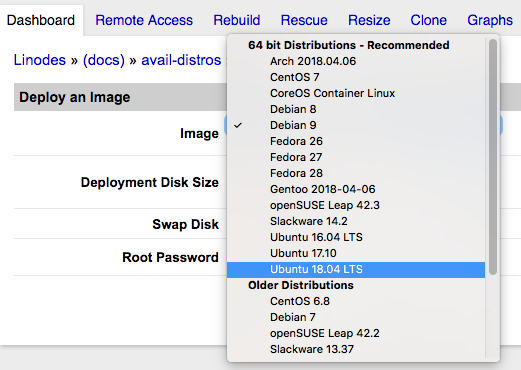

---
author:
  name: Alex Fornuto
  email: docs@linode.com
description: "Use the Linode Manager's GRUB 2 boot setting to run your distribution's native Linux kernel"
keywords: ["kvm", "custom linux", " kernel", "custom linode", "grub", "grub 2", "lassie"]
license: '[CC BY-ND 4.0](http://creativecommons.org/licenses/by-nd/4.0/)'
modified: 2017-03-03
modified_by:
  name: Linode
published: 2015-06-29
title: 'Run a Distribution-Supplied Kernel on a KVM Linode'
---

As of February, 2017, you can boot your Linode using your choice of Linode's own kernel or the upstream kernel provided by a distribution's maintainers. Booting with Linode's kernel is enabled by default, but changing to the distro-supplied kernel is easy. This is useful if you'd like to enable specific kernel features, or if you'd prefer to handle kernel upgrades yourself.

## Recommended Distributions

The steps in this section currently apply only to the distributions under *Recommended* in the Linode Manager's *Deploy an Image* dropdown.

1.  Shut down your Linode from the Linode Manager.

2.  Click **Edit** to view a distribution's configuration profile options:

    

3.  Under **Boot Settings** is a **Kernel** dropdown menu. By default, this will be set to the latest Linode-supplied 64 bit kernel:

    

4.  To switch to the distro's default kernel, select **GRUB 2** instead of the latest 64 bit.

    

5.  Click **Save Changes** at the bottom of the page and reboot into the new kernel.

Once booted, you can verify the kernel information with `uname`:

    uname -r

This should return something similar to:

    4.8.13-1-ARCH

If you want to switch back to the Linode kernel at any time:

1.  Shut down your Linode.
2.  Select the latest 64 bit Linode kernel using the steps above.
3.  Click **Save Changes** and reboot.

### Caveats

CentOS 7 and Fedora ship with SELinux installed and enabled by default. When switching from the Linode kernel to the CentOS or Fedora kernel, SELinux must run a relabeling of the filesystem to boot. Systemd will then reboot the Linode and if you have Lassie enabled, you'll be back at the login prompt shortly. If you do not have Lassie enabled, you will need to manually *Reboot* in the Linode Manager.

The relabel process is triggered by the empty `/.autorelabel` file.

    [root@li901-254 ~]# ls -a /
    .   .autorelabel  boot  etc   lib    lost+found  mnt  proc  run   srv  tmp  var
    ..  bin           dev   home  lib64  media       opt  root  sbin  sys  usr

We include a systemd unit and bash script in our CentOS 7 images to automatically create this file when the Linode kernel is booted. This will save you from needing to do it manually before rebooting into the upstream kernel. You'll find the systemd unit file at `/etc/systemd/system/selinuxfsrelabel.service`, which calls `/usr/local/bin/selinuxfsrelabel.sh`.

## Older Distributions

The steps in this section apply to distributions that are not found in the *Recommended* section when deploying an image.

At the time of this writing, these steps have been tested on:

* Arch Linux
* CentOS
* Debian
* Fedora 24
* Gentoo
* Ubuntu

### Install the Distribution Provided Kernel

1.  Ensure that your system is up to date using the distribution's package manager.

2.  Install the Linux kernel. The package name differs based on your distribution:

    #### Arch Linux

        pacman -S linux grub

    #### CentOS 7

        yum install kernel grub2

    #### Debian

        apt-get install linux-image-amd64 grub2

    #### Fedora

        dnf install kernel-core grub2

    #### Gentoo

        mkdir /boot/grub
        echo "GRUB_PLATFORMS=\"coreboot pc\"" >> /etc/portage/make.conf
        emerge --ask sys-boot/grub sys-kernel/gentoo-sources genkernel
        eselect kernel list
        eselect kernel set [# of new kernel]
        zcat /proc/config.gz > /usr/src/linux/.config
        genkernel --oldconfig all

    #### Ubuntu

        apt-get install linux-image-virtual grub2

    
During the installation of `grub` you may be asked which disk image to install to. Since Linode provides the grub bootloader, the system need only provide the `grub.cfg` file, and you don't need to install `grub` to your MBR.


    You'll see the kernel and other components you just installed and generated in the `/boot` directory. For example:

        [root@centos7 ~]# ls /boot
        config-3.10.0-514.el7.x86_64
        grub
        grub2
        initramfs-0-rescue-4f09fa5fdd3642fa85221d7c11370603.img
        initramfs-3.10.0-514.el7.x86_64.img
        initramfs-3.10.0-514.el7.x86_64kdump.img
        initrd-plymouth.img
        symvers-3.10.0-514.el7.x86_64.gz
        System.map-3.10.0-514.el7.x86_64
        vmlinuz-0-rescue-4f09fa5fdd3642fa85221d7c11370603
        vmlinuz-3.10.0-514.el7.x86_64

### Configure Grub

1.  Open `/etc/default/grub` in a text editor and go to the line beginning with `GRUB_CMDLINE_LINUX`. Remove the word `quiet` if present, and add `console=ttyS0,19200n8 net.ifnames=0`. Leave the other entries in the line. For example, on CentOS you should have something similar to:

        GRUB_CMDLINE_LINUX="crashkernel=auto rhgb console=ttyS0,19200n8 net.ifnames=0"

2.  Then add or change the following options to match the following example. There will be other variables in this file, but we are only concerned with these lines.

    
GRUB_TERMINAL=serial
GRUB_DISABLE_OS_PROBER=true
GRUB_SERIAL_COMMAND="serial --speed=19200 --unit=0 --word=8 --parity=no --stop=1"
GRUB_DISABLE_LINUX_UUID=true
GRUB_GFXPAYLOAD_LINUX=text



3.  Run the following command to prepare and update the bootloader:

    ##### Arch and Gentoo

        grub-mkconfig -o /boot/grub/grub.cfg

    ##### CentOS and Fedora

        mkdir /boot/grub
        ln -s /boot/grub2/grub.cfg /boot/grub/grub.cfg
        grub2-mkconfig -o /boot/grub/grub.cfg
        touch /.autorelabel

    
The autorelabel command is necessary to queue the SELinux filesystem relabeling process when rebooting from the Linode kernel to the CentOS or Fedora kernel.


    ##### Debian and Ubuntu

        update-grub

